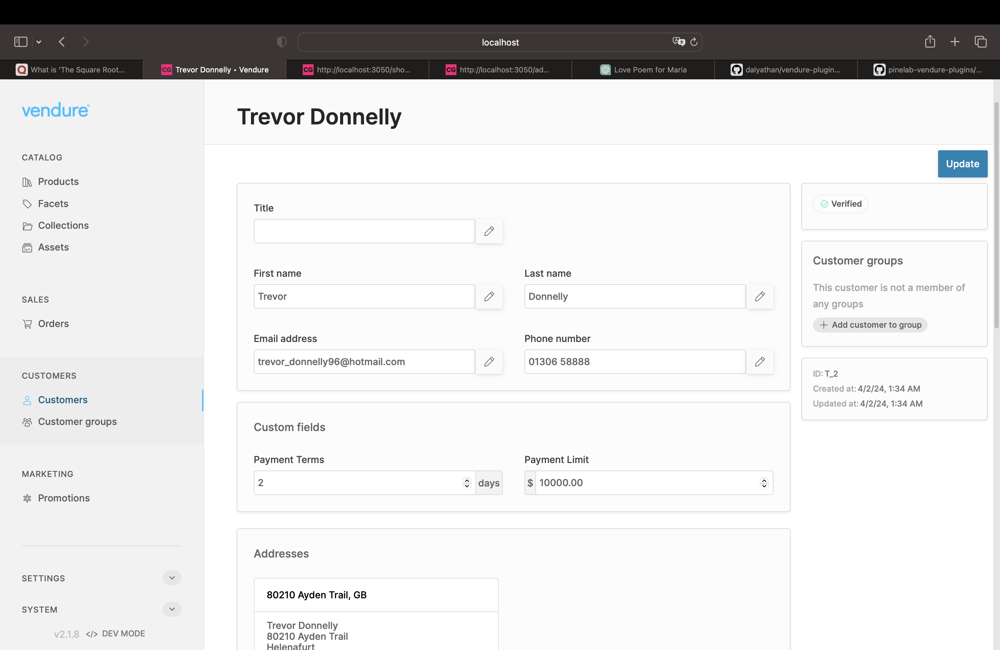
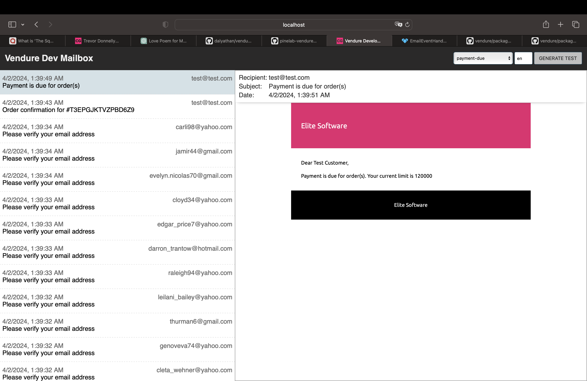
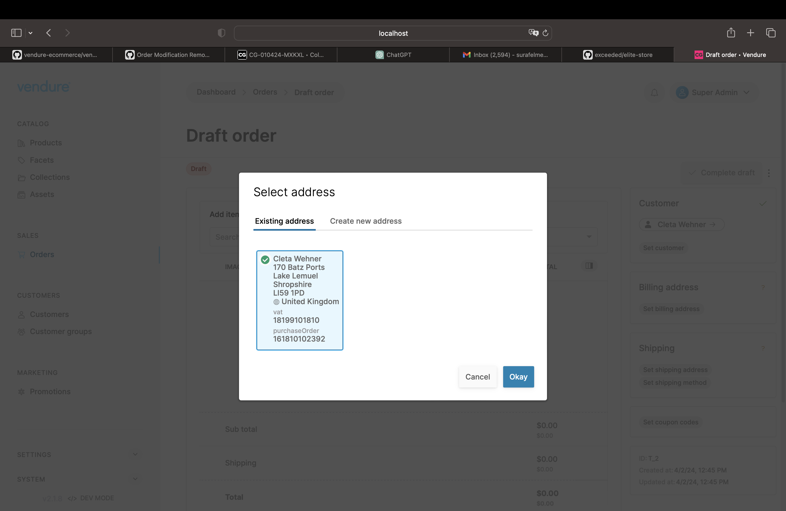

# Vendure Paymet Terms Plugin
This plugin allows certain customers to pay using Payment Terms. Payment Terms are when a customer is allowed to make a payment a certain number of days after an invoice is due.

## Getting Started
1. Make sure your email address is at `fromAddress` in `EmailPluginOptions.globalTemplateVars` (or `EmailPluginDevModeOptions.globalTemplateVars`)
2. Make sure to configure an email template under a folder named `payment-due`(see [this](https://docs.vendure.io/reference/core-plugins/email-plugin/#email-templates))

## Shipping Address new fields

